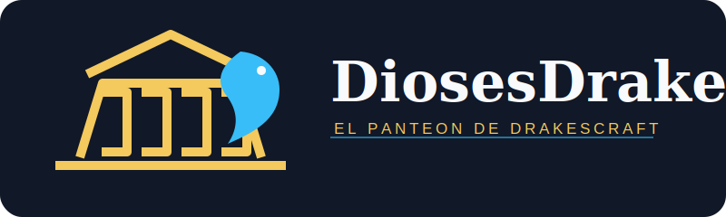

# DiosesDrakes



Progresion divina y drenajes economicos para **DrakesCraft**. Cada jugador invierte
en un dios, desbloquea poderes utiles y mantiene sus bendiciones activas mediante
dinero, ofrendas y juego real.

> Estado: nucleo en construccion. **Hefesto** sera el primer dios jugable.

## Que resuelve

- Crea destinos voluntarios y entretenidos para el dinero acumulado.
- Conecta progresion con Slimefun, addons, exploracion, maquinas y eventos.
- Mantiene AuraSkills como estadistica pasiva, sin duplicar XP ni arboles.
- Registra costos y efectos sensibles para que staff pueda auditar abusos.
- Respeta ProtectionStones y WorldGuard desde el diseno.

## Economia divina

| Mecanica | Funcion |
| --- | --- |
| Desbloqueo | Pago unico para obtener un nodo del arbol. |
| Mantenimiento | Cuota semanal mientras una bendicion este activa. |
| Ofrenda | Materiales vanilla o Slimefun configurados para cada ritual. |
| Activacion | Coste por uso en poderes de alto impacto. |
| Tesoro del Olimpo | Fraccion limitada para eventos, bosses y recompensas. |
| Drenaje | Fraccion retirada de circulacion para controlar inflacion. |

Los precios no se fijan hasta completar el censo de balances, ingresos y deudas.
Ningun jugador nuevo debe pagar el coste de una economia ya inflada.

## Panteon

El proyecto contempla olimpicos y dioses secundarios: Zeus, Hera, Poseidon,
Demeter, Atenea, Apolo, Artemisa, Ares, Afrodita, Hefesto, Hermes, Hestia, Hades,
Persefone, Hecate, Dionisio, Eros, Nike, Nemesis, Morfeo, Helios, Selene y Tique.

Se implementan **uno por uno**. Cada dios se publica con su arbol, costos,
restricciones, documentacion y prueba de balance antes de avanzar al siguiente.

## Reglas de progreso

- Solo puede haber un dios activo por jugador.
- Renunciar elimina el progreso del dios actual y activa 48 horas de espera.
- El nuevo dios siempre comienza desde cero.
- Las bendiciones suspendidas por falta de pago conservan progreso durante la gracia.
- Nunca se venden poderes de progresion o combate mediante Tebex.

## Modos de combate

En PvP normal las bendiciones divinas permanecen desactivadas. `PvPDivino` sera una
arena separada. Sus poderes son de combate y el progreso se obtiene jugando,
nunca comprandolo con dinero.

## Seguridad y protecciones

Los poderes no pueden romper, usar, abrir ni atravesar territorios ajenos. Las
integraciones Slimefun se habilitan por listas explicitas: una habilidad no obtiene
acceso a una maquina, receta o red por existir; debe estar autorizada en configuracion.

Poderes como el escaneo de minerales y la levitacion tendran coste, cooldown,
restricciones de combate y auditoria. No habra xray permanente, vuelo permanente ni
bypass de protecciones.

## Desarrollo

Requisitos: Java 21 y un servidor Paper/Purpur compatible con 1.21.1.

```powershell
mvn clean package
```

El JAR se genera en `target/`. Las integraciones externas son opcionales en el
arranque y se activaran solo cuando sus adaptadores esten listos.

Consulta [la arquitectura](docs/ARCHITECTURE.md) para responsabilidades, reglas de
seguridad y plan de lanzamiento.
