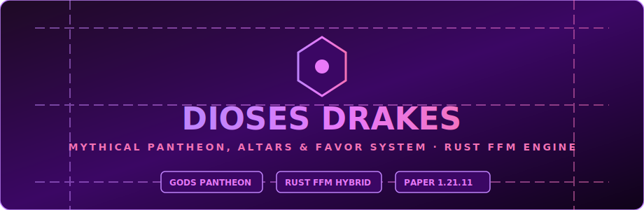

<div align="center">



# ⚡ DiosesDrakes

**Sistema Mítico de Dioses, Altares, Bendiciones y Favor Divino para DrakesCraft**

<p>
  <a href="https://github.com/DrakesCraft-Labs/DiosesDrakes"></a>
  
  
  
</p>

</div>

---

## ⚡ ¿Qué es DiosesDrakes?

`DiosesDrakes` es el plugin del Panteón de Dioses Míticos de DrakesCraft. Permite a los jugadores jurar lealtad a deidades griegas y nórdicas (Zeus, Ares, Poseidón, Hades, Odin, Loki, etc.), construir **altares sagrados**, realizar ofrendas y recibir bendiciones pasivas y activas.

---

## 🧰 Características Destacadas

- 🏛️ **Altares Sagrados**: Estructuras compuestas que acumulan poder y favor divino al realizar sacrificios y ofrendas.
- 🔮 **Bendiciones Míticas**: Buffs pasivos de combate, visión nocturna, regeneración, resistencia elemental y multiplicadores de drops.
- ⚡ **Aceleración Nativa en Rust (`RustNativeBridge`)**: Cálculo multihilo del nivel de poder de los altares y ticks de tributos directamente en Rust a nanosegundos.

---

## 🛠️ Compilación e Instalación

```bash
# Compilar paquete JAR con Maven
mvn clean package
```

Ubica el archivo compilado `DiosesDrakes.jar` en la carpeta `plugins/` de tu servidor Minecraft Paper/Purpur 1.21.11.

---

<div align="center">

**DrakesCraft Labs** · Maintained by [**JackStar6677-1**](https://github.com/JackStar6677-1)

</div>
