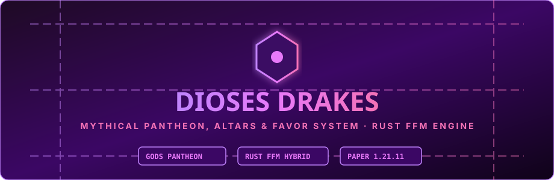

<p align="center">
  
</p>

# DiosesDrakes

## Scope at a glance

DiosesDrakes is the persistent divine-progression authority for DrakesCraft.
It owns UUID profiles, pantheon and patron selection, favor, skills, loadouts,
cooldowns, upkeep, Convergence, passive blessings and auditable divine
transactions. It does not own boss spawning, arena rewards, Tebex purchases or
Arcana elemental profiles.

The plugin exposes `DivineAccess` through Bukkit `ServicesManager`, allowing
DrakesBosses and ArcanaDrakes to consume divine context without sharing its
SQLite schema. Boss victories are idempotent, favor is bounded by configured
minimum/maximum values, and matching-pantheon victories can receive a
configurable bonus.

**The persistent divine-progression system for DrakesCraft on Paper/Purpur 1.21.11.** Players choose a pantheon and patron, unlock an intentional loadout of blessings, earn favor through approved boss content, and take part in the permanent Convergence anchors.

## Start here

- Run **`/dioses`** to open the pantheon and active-path menu.
- Run **`/dioses ayuda`** to open the in-game Convergence guide before selecting, spending, or renouncing anything.
- Run **`/dioses estado`** to see the active patron, current favor and upkeep state.
- Run **`/dioses libro`** for the portable Codex.

The menus are intentionally informational before they are transactional: they explain the permanent cost of a patron choice, skill requirements, favor sources, protection boundaries and anchor mechanics.

## The divine loop

1. Choose one pantheon, then one patron.
2. Unlock and equip a small, deliberate set of passive, active, stance and combat skills.
3. Defeat eligible Odysseia bosses to gain durable favor for the selected patron.
4. Spend favor at public Convergence anchors to support a pantheon.
5. Pay configured weekly upkeep to keep the divine path usable when the economy module is enabled.

Renouncing a patron intentionally clears favor, nodes and relics tied to that path. The configured 48-hour cooldown prevents faction hopping from becoming an exploit.

## Pantheons and Convergence

The foundation includes Greek, Nordic, Egyptian and Celtic pantheons. They are not flattened into one list: a player selects a pantheon first, then a deity with its own skill path.

Convergence anchors are permanent public locations. They do not claim blocks or damage survival worlds. Players offer their own active-patron favor to an anchor, which tracks the public contribution and pantheon dominance. Odysseia remains responsible for boss encounters; DiosesDrakes owns favor, skills, upkeep and Convergence state.

## Skills and safety

- Every patron path presents its nodes in the active-path menu, including state, type, tier, prerequisites and unlock information.
- Skills must be unlocked and equipped; players are not meant to have every ability active at once.
- Cooldowns, passives and ability execution are owned by the divine services and are audited.
- Normal claims are the default safety boundary. The dedicated divine PvP experience belongs in a deliberately configured arena, not ordinary protected survival land.
- Slimefun integration is limited to supported energy or machine bridges. DiosesDrakes never mutates Slimefun core storage.

## Arcana bridge

ArcanaDrakes may read the public `DivineAccess` Bukkit service to display a player's patron and current favor, then award a small Arcana-only resonance bonus for configured compatible pairings. Arcana never writes divine data, creates favor, spends favor or switches patrons.

## Configuration and operations

Routine balance belongs in `plugins/DiosesDrakes/config.yml`: economy/upkeep, Convergence anchors, boss-favor multipliers, protection integration and enabled subsystems. Keep secrets and production databases out of Git.

**Asgard:** Thor, Odin, Loki, Heimdall, Freyja y Tyr. **Duat:** Ra, Anubis, Isis,
Set, Bastet y Horus. **Tuatha de Danann:** Morrigan, Lugh, Brigid, Cernunnos y
Dagda. La Convergencia tambien abre **Takamagahara** con Amaterasu, Susanoo,
Tsukuyomi, Inari y Hachiman; **Ekur** con Marduk, Ishtar, Enki, Ereshkigal y
Nergal; **Teteocan** con Quetzalcoatl, Huitzilopochtli, Tlaloc, Tezcatlipoca y
Xipe Totec; y **Devaloka** con Shiva, Vishnu, Durga, Ganesha y Hanuman.

Cada patron dispone de quince nodos encadenados: cuatro **pasivas equipables**, siete
**activas** y cuatro **posturas temporales**. La carga final se limita a dos pasivas,
dos activas y una postura; desbloquear toda una rama no permite llevar todos los
poderes al mismo tiempo.

## Reglas de progreso

- Solo puede haber un dios activo por jugador.
- Renunciar elimina el progreso del dios actual y activa 48 horas de espera.
- El nuevo dios siempre comienza desde cero.
- Las bendiciones suspendidas por falta de pago conservan progreso durante la gracia.
- Nunca se venden poderes de progresion o combate mediante Tebex.

## Modos de combate

En PvP normal las bendiciones divinas permanecen desactivadas. `PvPDivino` sera una
arena separada. Sus poderes son de combate y el progreso se obtiene jugando,
nunca comprandolo con dinero.

## Seguridad y protecciones

Los poderes no pueden romper, usar, abrir ni atravesar territorios ajenos. Las
integraciones Slimefun se habilitan por listas explicitas: una habilidad no obtiene
acceso a una maquina, receta o red por existir; debe estar autorizada en configuracion.

`Pulso de Red` añade energia limitada a maquinas Slimefun expresamente permitidas
en `config.yml`, dentro del alcance y autorizacion del jugador. La lista inicial se
limita a la Mass Fabricator y al UU Crafter de LiteXpansion: consumidores de 16.666
y 50.000 J/s, respectivamente. No energiza generadores, baterias ni maquinas de la
linea Infinity/Cheat. `Ojo de Mena` marca
en el cliente una cantidad limitada de minerales durante ocho segundos, solo en
chunks cargados y donde WorldGuard permite interactuar. Ninguno modifica bloques,
inventarios ni protecciones.

Los veredictos y descargas primero descartan criaturas en claims ajenos mediante la
misma consulta de WorldGuard que protege las mutaciones de bloque. Las explosiones
divinas son solo particulas, sonido y displays: no invocan TNT ni `createExplosion`,
no rompen bloques, no incendian y no empujan jugadores.

## Hefesto: uso actual

1. Selecciona a Hefesto en `/dioses`.
2. Compra el primer nodo desde el menu o con `/dioses desbloquear hephaestus.forja_viva`.
3. Equipa una bendicion con el menu o `/dioses equipar <id>`.
4. Activa los poderes con `/dioses usar hephaestus.pulso_de_red` o
   `/dioses usar hephaestus.ojo_de_mena`.

## Códice y feedback

`/dioses libro` entrega el **Códice Divino**. El libro no conserva permisos ni
progreso: solamente explica la senda activa del jugador y puede pedirse de nuevo
sin riesgo. Para consultar cualquier nodo puntual existe `/dioses info <id>`.

Las activaciones muestran duración y recarga en la barra de acción. Cada familia
divina tiene partículas, color, sonido y escenas nativas de Paper con `BlockDisplay`;
las descargas forman una detonación visual, los dominios trazan un anillo animado,
el vuelo deja estela y los avatares reciben halo. Las escenas no requieren resource
pack, se limitan a ocho displays por jugador y se limpian al terminar, desconectar o
deshabilitar el plugin. Con Floodgate, Bedrock conserva sonidos y particulas; los
displays quedan desactivados por defecto hasta validarlos en movil. Hefesto además muestra la energía
que logró inyectar en cada pulso. El menú del panteón deja visible el tipo del nodo,
su nivel, coste, prerrequisitos, duración y recarga antes de comprarlo.

## Arbol divino

Los 72 patronos de los ocho panteones suman **1.080 nodos jugables**. Estos nodos
combinan identidades propias con familias de efecto auditables; no son 1.080
listeners independientes. Los hitos de ascension son
mecánicas reales: descargas sin daño de bloque, movilidad que solo permite vuelo a
patronos de viento, dominios personales de clima, crecimiento de cultivos y saplings
dentro de claims autorizados, veredictos PvE de 100 de daño y avatares colosales
temporales. Los cinco nodos de maestria final agregan puños con mano vacia, arco de
espada, golpe de hacha o maza, estocada de lanza, carrera y guardia reactiva contra
criaturas. Nada de esto puede golpear jugadores en survival normal; PvPDivino
mantiene su propio control regional.

La referencia jugable para la comunidad se publica en
`https://web.drakescraft.cl/dioses.html`. Al cambiar `SkillCatalog`, actualiza la
página pública en el mismo cambio para que el juego y su documentación no diverjan.

Las compras pasan por Vault, quedan en `plugins/DiosesDrakes/audit/` y se recuperan
por identificador si una operacion debe reintentarse. El mantenimiento se revisa al
conectar y cada cinco minutos; tras las 24 horas de gracia, las bendiciones se
suspenden sin borrar progreso hasta el siguiente pago exitoso.

## Desarrollo

Requisitos: Java 21 y un servidor Paper/Purpur compatible con 1.21.11.

```powershell
mvn clean package
```

Routine balance belongs in `plugins/DiosesDrakes/config.yml`: economy/upkeep, Convergence anchors, boss-favor multipliers, protection integration and enabled subsystems. Keep secrets and production databases out of Git.

Back up the current JAR, config and `diosesdrakes.db` before deployment. Replace one JAR during a planned restart, then verify startup logs, `/dioses ayuda`, `/dioses estado`, an active skill menu and a non-commercial boss reward test.

## Authorship

Created for DrakesCraft by **JackStar**.
